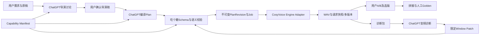

# 新架构、UI、数据迁移与测试

## 模块责任与最小实现规模

首版仍是本地Electron/React＋SQLite，不增加云后台、账号系统或软件内LLM调用。Compiler为ChatGPT遵循的文档合同，软件内只存在验证和确定性序列化，不安装会自行决定怎么演的Agent。

| 设计模块 | 职责 | 禁止行为 |
|---|---|---|
| CapabilityRegistry | 加载内置版本化profile，模型/transport/产品策略查表 | 接受Plan自带未知profile扩大能力 |
| ProtocolValidator | Draft2020-12结构校验＋哈希、覆盖、锁、能力语义校验 | 静默修字段、默认补导演意图 |
| PlanRepository / RevisionService | 不可变Plan/局部修订/人工编辑、乐观并发 | 覆盖历史或自动rebase陈旧Patch |
| PatchService | preview Diff、目标保护、应用事务、durable job | 合并/拆分Window、改无关Window |
| EngineAdapter | 校验绑定音色、编译指定SSML、映射官方input、请求和恢复 | 推测情绪、加入新标点、自动换引擎 |
| GenerationJobRunner | 顺序生成选定范围，attempt状态、未知付费防重复 | 自动重发已发送但结果未知请求 |
| VersionRepository | 所有版本、A/B、当前指针、参数快照、软删除 | 把“选旧音频”当作“恢复旧参数” |
| RehearsalService | 按anchor引用执行/复用完整Window，绑定通过状态 | 取前三句、自动补三个anchor |
| DiagnosticExporter | 复制实际WAV、固定十维反馈和准确上下文 | 音频打分、自动诊断、假称ChatGPT已听 |
| ConcatService / GoldenRepository | 指定顺序和静默、真实格式验证、人工确认快照 | 自动裁静音/润色音频/选最佳版本 |

`TTS Capability Profile + ChatGPT Compiler Spec + Engine Adapter`保留引擎扩展边界；首版只实现CosyVoice3.5Plus HTTP非流式。schema engine不固定某模型，但运行registry只允许已安装支持的profile；新引擎需要新的profile、对应编译规范和Adapter。不是增加一个模型名就假称兼容。

## 新版UI流程

首页只含：任务名称、复刻音色、执行协议大文本框、【导入并校验方案】。不存在“粘台词生成导演”“软件导出阶段一”。底部可有外部文档包下载入口，不基于用户台词生成导演任务。

全部真人口播帮助文档点击后用独立非模态Electron窗口打开，支持同时对照操作；固定顶部复制全文与关闭按钮；同文档复用窗口。查看器不写task state、不调用导演导出。专项架构及Windows10/11验收见[08-独立文档查看器设计.md](08-独立文档查看器设计.md)。

校验页：先列能力版本/原稿/Window/anchor/锁定项/unresolved；错误定位字段并给真实原因。提供【查看方案】【保存执行方案】。没有hash的草案计算绑定，导演稿附件可选；显示来源声明确认区，不阻挡无附件导入。选中音色与Plan要求不匹配不能保存为可执行。

工作台：顶部任务/音色/PlanRevision/profile；左侧Window原文列表，右侧窗口详细卡。原稿默认只读，不提供自动重新解析按钮；结构变更入口是【导入新Plan Revision】。

锚点区：每个Plan anchor一个卡片，显示测试目的、引用Window、配置binding、音频版本、【生成】【播放】【通过/不通过】。数量由Plan决定。修改对应Window/voice/profile后该anchor通过状态失效，其他不相关anchor不失效。未通过只作明显提醒，不恢复全局试演硬门禁，用户仍可生成任一合法Window。

窗口卡：原文、synthesisText/读法Diff、Instruction及加权计数、rate/pitch/volume/seed、pause/SSML、pronunciation、Director Reference、E0/E1/E2/E3逐项说明、当前配置revision、当前选中音频V号。允许修改真实参数，超建议值提示、超官方/产品硬限拒绝；有草稿则生成前要求保存或取消。

历史区：V4/V3/V2/V1按generatedAt降序，时间相同按version sequence。单次生成必须新versionId和唯一路径；选择/播放任一版本；任意两版A/B；【选为当前音频】【从本版恢复参数】分开；回滚实际通过上述两种动作明确进行。A/B允许“差不多/都不好”，不强制最佳。旧音频永远保留；删除未锁版只是隐藏，可以恢复。

每个窗口修复区：大文本框【ChatGPT修复方案】，输入REAL_SPEECH_EXECUTION_PATCH_V2；【校验】【查看Diff】【应用并生成新版本】。多Window Patch也可在任务修复入口使用；单Window入口强制target仅该Window，不能悄悄接受多目标。

生成：单Window、多选Window、全文分别明确范围，提交前显示目标列表和已有版本数。首版按选定原文顺序串行，每窗口独立job state；失败的窗口不阻断无关后续窗口，unknown窗口禁止自动重发。取消只取消未发送job；已发送保持awaiting/unknown，不能显示为云端已取消。

诊断：范围【全文/本Window/多选Window】，提供固定十维“好/有问题/不确定/未评估”与自然语言备注。点击【导出诊断包】只准备资料和拷贝文件。音频缺失时给明确错误，不拿历史另一版代替。全文若缺当前一致拼接，允许导出窗口集合并标finalUnavailable，不能伪称全篇已生成。

拼接：顺序固定来自Plan，取明确selectedVersionId，显示参数与所选音频是否一致；不一致提示生成当前配置或恢复配置，禁止把旧WAV伪装成新方案。按Plan transition拼接产生新的FinalVersion。前后版本可保留对照。

Golden：用户完整试听、确认发音/接缝、愿意使用后保存GoldenSnapshot。Golden不是自动活人感评分；选中结果/transition/Plan发生变化，当前final stale，旧Golden仍可回放和追溯。生成了新候选但未选用，不应使旧Golden本体失效。

## 数据模型

建议独立新增V2表，不把大JSON runtime继续作为唯一记录。保留旧表只读兼容：

| 实体 | 关键字段/绑定 |
|---|---|
| task_v2 | taskId,name,voiceBinding,activePlanId,taskRevision,deletedAt |
| plan_revisions_v2 | planId,parentPlanId,canonicalHash,profileId/version/hash,originalTextHash,immutablePlanJSON,confirmation |
| window_configs_v2 | taskId,windowId,configRevision,planId,configHash；每次保存追加，窗口结构来自Plan |
| generation_jobs_v2 / attempts_v2 | jobId,windowId,configRevision,requestFingerprint,status,clientRequestId,providerRequestId,response evidence；先落盘后发网 |
| audio_versions_v2 | versionId,windowId,sequence,configHash,fileHash,path,generatedAt,requestSnapshot,hiddenAt；sequence只增不复用 |
| window_selections_v2 | taskId,windowId,selectedVersionId,selectionRevision |
| anchor_reviews_v2 | anchorId,bindingHash,versionId,pass/notPass,feedback；绑定完整音色、文本、参数、profile |
| patches_v2 | patchId,baseHash,patchHash,newPlanId,changedWindowIds,jobId,diagnosis；unique patchId |
| final_versions_v2 | finalId,path/fileHash,orderedVersionIds/fileHashes,transitions,concatRecipe,planId,bindingHash |
| golden_snapshots_v2 | goldenId,finalId,finalHash,selectedVersionIds,Plan/profile/QC/确认时间；全部immutable |
| exports_v2 | exportId,范围、版本、bindings、文件清单及SHA-256；供Patch乐观并发 |

runtime JSON与机器Plan不混放状态字段；taskRevision记录UI状态，configRevision单独记录可执行变更。配置、所选音频、Plan结构的hash各自明确，不能拿taskRevision当音频版本。

诊断包目录：manifest.json、plan.json、capability-profile.json、window-configs.json、selected-request-snapshots.json、history-metadata.json、feedback.json、README.md、audio/选中Window WAV、可用时audio/current-final.wav。manifest含task/plan/hash/profile/version、selection及配置version、文件hash、范围、时间、原文。历史默认只元信息，可选附WAV；secret/account密钥/签名下载URL/绝对机器路径不进入导出包；voice只含安全标识和绑定hash。明确所选WAV与当前编辑配置差异。

## 迁移与回退

1. 实现前冻结基线，关闭任务写入，SQLite在线backup或VACUUM INTO取得一致快照；WAL模式不能仅复制主db。清点所有WAV、assets、archives、finals和Golden，记录数量/hash/缺失清单，不修改音频。
2. 新V2表与migration ledger在事务创建，记录schema version和源DBhash。旧tables完整保留；旧程序看到新schema只能明确拒绝或通过原备份启动，不能把新版旧表回写当兼容。
3. 全部旧任务标legacyReadOnly，保留旧导演稿/协议/请求/计费未知状态，能播放旧音频和导出历史。新版主列表有“历史任务”视图，不再让旧Director协议成为新流程。
4. 旧明确Window/请求快照可由确定性迁移器生成`legacy-draft`，不能补编Instruction/anchor/确认。缺voice、参数、synthesisText、真实hash或复杂JOINT历史则标待补全；不能假装已确认V2。
5. 用户要继续生产时导出旧原稿/参数/历史给ChatGPT重新确认V2 Plan，创建关联的新V2任务。旧音频作为历史导入版本，保留versionId映射和真实请求；只有完全相同request fingerprint/voice/profile且人工认可时才可选入新final，不能默认复用。
6. legacy试演通过不自动变为新anchor通过；旧Golden原样保留为legacyGolden，不转换成已验收V2。unknown/interrupted原请求证据与保护一并迁移，不能借“新任务”自动重发未核对的同指纹请求。
7. 分批迁移，重复启动幂等，不再造副本；失败rollback DB并保留备份，文件以临时目录manifest事务处理，出现孤立文件可清点恢复。不自动删旧数据。
8. 验证旧WAV字节hash、版本数量/选中指针/GW覆盖/Golden引用/资产链接一致；存在缺失先报告。回退用迁移前DB与原程序，新V2新增输出单独保留导出，不能在回退时销毁。

## 回归风险与测试计划

| 风险 | 必须验证的行为 |
|---|---|
| 能力真值漂移 | UI、validator、Adapter、三文档由相同profile；HTTP/WS枚举分离；超官方与超建议错误不同；未知profile拒绝 |
| Instruction编码 | Han/扩展汉字/标点/字母/emoji边界；weighted100通过101拒绝；41汉字但≤100通过；不自动截断 |
| Schema与原稿完整性 | 每层未知字段/重复JSON键/多个协议拒绝；Unicode码点offset；CRLF/emoji/重复短句不丢不乱；hash错误拒绝 |
| E3伪控制 | wordLevel/curve/自造emotion不能进入API；未解决Window阻断；经确认近似完整记录 |
| SSML与hotFix | break官方边界、0不插节点、连续超限拒绝、重叠区间/错slice/XML注入/双停顿/重复纠音拒绝；实际input snapshot白名单 |
| Patch越权/陈旧 | 无关Window数据与WAV hash逐字不变；版本已变/baseHash错/锁交集拒绝；失败事务不改一半；双击一个job |
| 多锚点绑定 | 0/1/2/4等数量按Plan呈现；不自动前三句；相关修改才失效；同Window可复用同版本；不设置固定时长/全局门禁 |
| 多版本与回滚 | 保存参数不覆盖旧WAV；生成路径唯一；切音频不改配置；恢复配置形成revision；任意两版A/B；隐藏可恢复、Golden引用不可删除 |
| 已发请求中断 | 发送前durable记录；超时/崩溃unknown不补发；响应成功下载失败GET恢复；URL过期明确说明；取消未发送和已发送分开 |
| 拼接与Golden | 缺选中版不fallback；真实FFprobe/FFmpeg完整解码；指定静默误差≤一个sample；本地拼接不调TTS；新配置未生成拒绝假一致final |
| 迁移/资产 | v1/v2库、损坏库、缺WAV、archives、相同hash多路径、重复迁移、回退；未知计费不能绕过；旧音频字节不变 |
| 其他模块 | 普通audio/复刻音色/转文字/视频/一键生成/一键复刻/账号/资产库；共享profile变化不能打断原能力 |

实施检查分层：纯validator/schema/transaction测试 → Adapter HTTP mock请求与错误 → 真FFmpeg媒体测试 → DOM交互 → 生产Electron主IPC端到端 → Windows打包启动 → 少量真实CosyVoice付费验证与用户听感验收。使用声明支持的Node>=24.19.0；不把DOM模拟当生产IPC。

听感验收用用户已确认真实原稿与同一音色，开场/解释/价格/CTA及接缝对照。先保持同一seed，只变一个已确认因素；再必要比较seed候选，不把seed更大视为质量提升。记录十维用户判断和采用版本、调用数量、实际usage及账单；不虚构成功率、预算阈值或真人感分数。按用户认可决定继续；连续无改善时由ChatGPT重审样本/导演稿并提出方案，软件不自行诊断或自动重试。

## 批准后的实现优先级

前置关卡：获批Capability Spike及启用决策完成，再冻结Profile/Plan/Patch；正式开发另行授权。P0：profile与strict validator、Plan导入、revision/job/unknown保护、旧数据只读；P1：Window生成/多版本/任意A-B/多anchor/Patch Diff；P2：多选诊断/拼接/Golden/迁移继续生产；最后统一文档镜像、完整回归和打包验收。每层先本地验证后进入下一层，云端验收作为付费任务单独记录。当前停止在设计阶段。

文档查看器作为P1并列工作项，但必须先在P0约定DocumentRegistry、独立preload/renderer打包边界和生命周期接口。不能在V2交付中沿用rs-modal覆盖层。

## R2评审修订（替代旧稿中冲突的准入与开发顺序）

软件最短工作流：任务名称 → 复刻音色 → 粘贴Plan → 导入并校验。用户声明Plan来自已确认导演方案后，软件创建自己的确认记录；导演稿附件及documentHash均可选，不能强制上传。导演沟通阶段仍需确认方向，但这不是软件额外文件门槛。

开发顺序改为：R2设计评审 → 用户第二次确认 → 逐项明确批准付费Spike范围/请求上限/预算上限 → 隔离的Capability Spike → 效果报告及产品启用决策 → 一起冻结Capability Profile、Plan V2、Patch V2 → 获得正式开发授权后开始V2运行源码开发。设计批准不等于API扣费批准，也不等于正式开发批准。本轮没有进入Spike执行。

intentRanges用于展示和诊断；软件不自行导演。候选SSML包含sub及连续speak局部rate/pitch；正式是否启用由Spike判断，不能预先排除。仅说明变更不重新生成；实际execution变更才创建生成任务。文档查看器继续采用08的独立non-modal BrowserWindow设计，新增词典和Spike帮助资料统一进入documentId注册表，全文复制原始Markdown。
